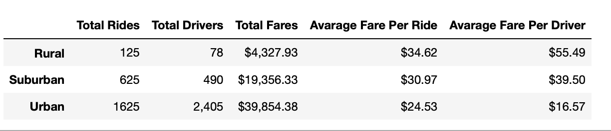

# PyBer_Analysis

## Overview of the analysis:

The purpose of the new analysis is well defined. (3 pt)
	
This challenge is to analyze the ride sharing data by city and present our observations to V.Isualize, the CEO of Pyber. During the analysis, we merge the 2 datasets, city and ride data, and get insights into how Pyber performs in the city types. The first task is to get ride sharing summary by city type and the second task is to use various methods like pivot and loc to zoom in on specific information, in this case, data from 1st January through 29th April of 2019. Then display the ride sharing summary in a plot.

## Results:

There is a description of the differences in ride-sharing data among the different city types. Ride-sharing data include the total rides, total drivers, total fares, average fare per ride and driver, and total fare by city type. (7 pt)

Task 1:

Here is the ride-sharing summary by city type:

## Summary:

There is a statement summarizing three business recommendations to the CEO for addressing any disparities among the city types. (4 pt)

